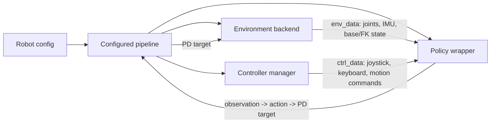
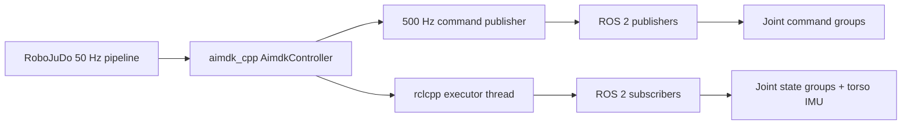
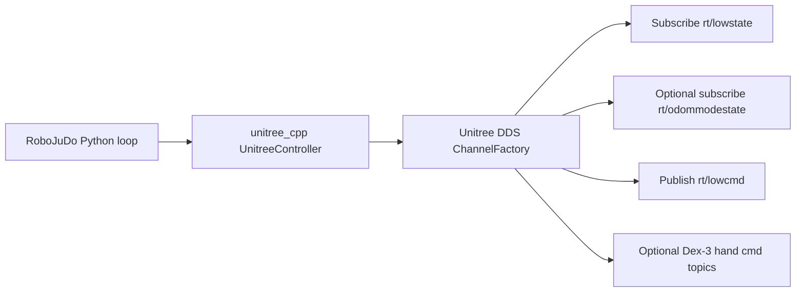

# RoboJuDo System Schematic

This document summarizes the current RoboJuDo deployment architecture for simulation-to-simulation (sim2sim) and simulation-to-real (sim2real), including the new AgiBot X2 path and the existing Unitree G1 path.

## Shared Pipeline

RoboJuDo uses the same high-level loop for all supported robots. A config selects one pipeline, one environment backend, one or more controllers, and one policy. Most deployments use `RlPipeline`; X2 uses `X2DeployPipeline`, which adds explicit preparation and safety modes around the RL loop.



The `PolicyWrapper` adapts joint order between the environment DoF config and policy DoF config. This lets policies use their own observation/action joint sequence while the environment keeps the robot-native order. The environment then executes the final PD target.

## Sim2Sim System

Sim2sim uses `MujocoEnv`. The policy loop, controller handling, DoF adaptation, safety checks, and debug visualization are the same as real deployment; only the environment backend is MuJoCo.

For each control step, `MujocoEnv` reads `qpos`, `qvel`, base pose, base velocity, and optional FK state from the MuJoCo model. It computes torques from the PD target:

```text
torque = kp * (pd_target - dof_pos) - kd * dof_vel
```

Torques are clipped by configured limits, routed to MuJoCo actuators by joint name, and applied for `sim_decimation` physics steps. Joint-name actuator routing is important for robots such as X2, where XML actuator order can differ from environment joint order.

Typical commands:

```bash
python scripts/run_pipeline.py -c g1
python scripts/run_pipeline.py -c x2
```

## Sim2Real System

Sim2real keeps the configured pipeline and policy interface, but swaps `MujocoEnv` for a robot-specific real environment. The real environment is responsible for reading hardware state and publishing PD targets to the robot SDK or middleware.

For real deployment, configs enable safety checks and robot-native controllers. A controller command such as `[SHUTDOWN]` stops actuation, while simulation-only commands such as `[SIM_REBORN]` are only available when the selected environment implements them.

Typical commands:

```bash
python scripts/run_pipeline.py -c g1_real
python scripts/run_pipeline.py -c x2_real
```

## X2: MuJoCo And ROS 2/AimDK

The X2 sim2sim config `x2` uses `X2DeployPipeline`, `X2MujocoEnvCfg`, and the shared `MujocoEnv`. The pipeline exposes four modes in both simulation and real deployment:

- `PASSIVE_DEFAULT`: publish zero stiffness and damping.
- `DAMPING_DEFAULT`: apply damping to every X2 joint.
- `JOINT_DEFAULT`: interpolate all 31 joints to the known deployment pose.
- `RL_DEFAULT`: run the ONNX policy after joint preparation completes.

The A/B/Y/X controller buttons select passive, damping, joint-default, and RL modes respectively. RL entry is rejected until `JOINT_DEFAULT` completes. Leaving the prepared state requires another joint-default transition before RL can resume.

X2 simulation also enables a configurable `ElasticBand` on `torso_link`. `MujocoEnv` evaluates its tension-only spring-damper force before every physics substep and writes the world-frame force to `xfrc_applied`. The viewer draws a capsule from the body to the world anchor and hides it when released. Keyboard keys 7, 8, and 9 lower, lift, and toggle the band. This force and visualization path is absent from the real environment.

`X2DeployPolicy` loads the ONNX model from `assets/models/x2/x2_rl_deploy`. The expected model interface is:

- Input `obs`: `1x151`
- Input `time_step`: `1x1`
- Output `actions`: `1x29`

The X2 policy controls 29 joints. The X2 environment has 31 DoFs, including two head joints. `PolicyWrapper` maps the 29 policy joints into the 31-DoF environment target. Passive, damping, and joint-default modes address all 31 joints; RL mode restricts position commands to the policy's 29-joint sequence.

The `x2_locomimic` and `x2_locomimic_real` presets use `X2LocoMimicPipeline` to place the existing interpolation manager
inside the same X2 mode state machine. Locomanipulation supplies the 15-joint loco policy and optional ZMQ arm targets;
`x2_rl_deploy` supplies the 29-joint test mimic. Switching and policy time advance only in `RL_DEFAULT`, and leaving RL
cancels any transition and restores loco for the next prepared entry. Reaching the mimic's configured ONNX phase limit
also emits `MOTION_DONE` and starts the normal return-to-loco interpolation.

For sim2real, `x2_real` uses `AgiBotCppEnv`, which wraps the `aimdk_cpp` C++ extension. Python calls `AimdkController.get_robot_state()` during `update()` and `AimdkController.step(pd_target)` during `step()`.



The C++ bridge initializes ROS 2 once, creates a single-threaded executor, and spins it in a background thread. It subscribes with `SensorDataQoS` to:

- `/aima/hal/joint/leg/state`
- `/aima/hal/joint/waist/state`
- `/aima/hal/joint/arm/state`
- `/aima/hal/joint/head/state`
- `/aima/hal/imu/torso/state`

It publishes grouped `aimdk_msgs/msg/JointCommandArray` commands to:

- `/aima/hal/joint/leg/command`
- `/aima/hal/joint/waist/command`
- `/aima/hal/joint/arm/command`
- `/aima/hal/joint/head/command`

Each command carries joint name, target position, zero velocity/effort feedforward, stiffness, and damping. Python updates targets at 50 Hz while the C++ bridge republishes the active mode at 500 Hz. `set_control_joint_names()` selects all 31 joints during preparation and the exact 29-joint policy sequence during RL.

The position-command watchdog is latched: a stale Python target switches the publisher to damping, and later `step()` calls are rejected until the pipeline explicitly arms position control. Stale robot state or invalid targets also force the X2 pipeline into damping.

## G1: MuJoCo And Unitree DDS

The G1 sim2sim config `g1` uses `G1MujocoEnvCfg` and the same `MujocoEnv` backend. Policies and controllers can be swapped through config classes such as `g1`, `g1_asap`, `g1_beyondmimic`, and `g1_locomimic`.

For sim2real, `g1_real` uses `UnitreeCppEnv`, which wraps the `unitree_cpp` C++ extension. Python reads robot state from `UnitreeController.get_robot_state()` and sends PD targets through `UnitreeController.step()`.



`UnitreeController` initializes DDS with the configured network interface, usually `eth0`, by calling `ChannelFactory::Instance()->Init(0, net_if)`. It releases the built-in motion control service before low-level control.

The main DDS channels are:

- `rt/lowstate`: low-level motor state, IMU, mode machine, and wireless remote state
- `rt/lowcmd`: low-level motor position, velocity, torque, `kp`, and `kd` commands
- `rt/odommodestate`: optional Unitree sport odometry used when `odometry_type="UNITREE"`
- `rt/dex3/left/cmd` and `rt/dex3/right/cmd`: optional Dex-3 hand commands

Incoming low-state messages are CRC-checked before updating the internal robot state buffer. Outgoing low-command messages are filled from the latest motor command buffer, assigned `mode_pr` and `mode_machine`, CRC-stamped, and written to DDS. `step()` sends commands immediately, while recurrent writer threads maintain command publication at the configured control period.

## Practical Notes

- Sim2sim and sim2real share policy code; backend differences are isolated in environment classes.
- Correct joint naming is part of the deployment contract. Environment, policy, MuJoCo XML, ROS 2 topics, and DDS motor order must remain consistent through `DoFConfig` and adapters.
- Real robot configs should keep `do_safety_check=True` and verify the shutdown controller path before running learned policies.
- X2 ROS 2 deployment depends on the AimDK workspace and `aimdk_cpp` extension being built in the development environment.
- G1 DDS deployment depends on the Unitree SDK, correct network interface, and access to low-level control topics.
