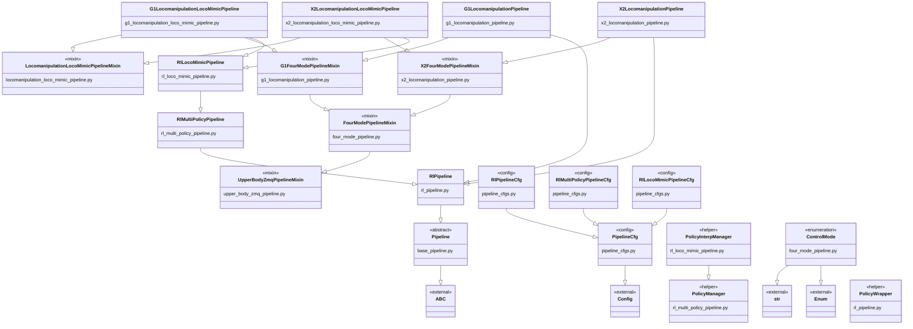

# `robojudo.pipeline` 类继承关系

下面的类图覆盖 `robojudo/pipeline/` 中定义的全部 class。箭头从父类指向子类；
`external` 表示父类定义在该目录之外。没有连线的类没有显式声明父类（隐式继承
`object`）。

## 阅读重点

- `RlPipeline -> RlMultiPolicyPipeline -> RlLocoMimicPipeline` 是运行时 Pipeline 的主继承链。
- G1 和 X2 的最终 Pipeline 使用多继承，把机器人/控制模式 Mixin 与运行时 Pipeline 组合起来。
- `LocomanipulationLocoMimicPipelineMixin` 没有自己的显式父类，但同时被 G1 和 X2 的 LocoMimic Pipeline 复用。
- 三个具体 RL 配置类都直接继承 `PipelineCfg`，它们之间没有继承关系。
- `PolicyWrapper` 是无显式父类的独立辅助类，因此图中没有继承连线。
